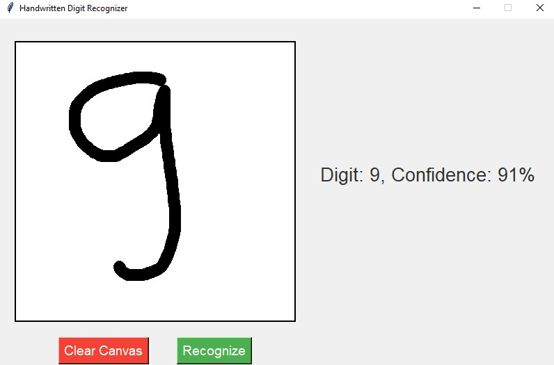

# ✍️ Handwritten Digit Recognizer

Real-time handwritten digit recognition using a Convolutional Neural Network trained on the MNIST dataset. Features an interactive drawing canvas where users can draw digits and get instant predictions with confidence scores.



## ✨ Features

- **Interactive Drawing Canvas**: Draw digits with your mouse on a 400x400 pixel canvas
- **Real-Time Recognition**: Instant classification as you draw
- **Confidence Scores**: See how confident the model is about its prediction (0-100%)
- **Clean & Simple GUI**: User-friendly Tkinter interface
- **High Accuracy**: CNN achieves 99%+ accuracy on MNIST test set
- **One-Click Clear**: Reset the canvas to draw a new digit

## 🎯 How It Works

1. **Draw a digit** (0-9) on the white canvas using your mouse
2. **Click "Recognize"** to classify the digit
3. **View the prediction** along with the confidence percentage
4. **Click "Clear Canvas"** to start over

## 🧠 Model Architecture

The digit recognizer uses a **Convolutional Neural Network (CNN)** with:

- **4 Convolutional Layers** (32 and 64 filters)
- **Batch Normalization** for faster training and better accuracy
- **Max Pooling** for dimensionality reduction
- **Dropout Layers** (30%, 40%, 50%) to prevent overfitting
- **Dense Layers** with 512 neurons
- **Softmax Output** for 10-class classification (digits 0-9)

### Training Configuration
```python
Batch Size: 128
Epochs: 150
Optimizer: Adam (learning rate: 0.001)
Loss Function: Categorical Crossentropy
Dataset: MNIST (60,000 training + 10,000 test images)
```

### Model Performance

- **Training Accuracy**: ~99.5%
- **Test Accuracy**: ~99.2%
- **Loss**: <0.03
- **Inference Time**: <100ms per prediction

## 🚀 Getting Started

### Prerequisites
```bash
pip install tensorflow
pip install pillow
pip install pywin32
pip install numpy
```

### Running the Application

1. **Train the model** (optional - if you want to retrain):
```bash
python hand_topmodel.py
```
This will train the CNN on the MNIST dataset and save it as `mnist_adam+batch_150_epochs.h5`.

2. **Launch the GUI**:
```bash
python gui.py
```

3. **Start drawing and recognizing digits!**

## 📁 Project Structure
```
Handwritten-Digit-Recognizer/
├── gui.py                              # Main GUI application
├── hand_topmodel.py                    # CNN training script
├── current_digit.png                   # Sample digit image
├── mnist_adam+batch_150_epochs.h5     # Trained model (excluded, too large)
└── images/
    └── screenshot.jpg                  # Application demo
```

## 🔧 Technical Details

### Image Processing Pipeline

1. **Capture**: Screenshot of canvas using `ImageGrab`
2. **Resize**: Scale to 28×28 pixels (MNIST format)
3. **Grayscale Conversion**: Convert RGB to single channel
4. **Inversion**: Invert colors (white digit on black background)
5. **Normalization**: Scale pixel values to [0, 1] range
6. **Prediction**: Feed through CNN for classification

### GUI Components

**Drawing Canvas:**
- 400×400 pixel white canvas
- Drawing radius: 8 pixels
- Black brush color
- Smooth continuous drawing

**Control Buttons:**
- **Clear Canvas** (Red): Reset the drawing area
- **Recognize** (Green): Run digit classification

**Results Display:**
- Shows predicted digit (0-9)
- Displays confidence percentage
- Updates instantly after recognition

## 🎓 CNN Architecture Details
```python
Model: Sequential
_________________________________________________________________
Layer (type)                Output Shape              Params   
=================================================================
Conv2D (32 filters, 3×3)    (None, 26, 26, 32)       320      
BatchNormalization          (None, 26, 26, 32)       128      
Conv2D (32 filters, 3×3)    (None, 24, 24, 32)       9,248    
BatchNormalization          (None, 24, 24, 32)       128      
MaxPooling2D (2×2)          (None, 12, 12, 32)       0        
Dropout (0.3)               (None, 12, 12, 32)       0        

Conv2D (64 filters, 3×3)    (None, 10, 10, 64)       18,496   
BatchNormalization          (None, 10, 10, 64)       256      
Conv2D (64 filters, 3×3)    (None, 8, 8, 64)         36,928   
BatchNormalization          (None, 8, 8, 64)         256      
MaxPooling2D (2×2)          (None, 4, 4, 64)         0        
Dropout (0.4)               (None, 4, 4, 64)         0        

Flatten                     (None, 1024)             0        
Dense (512 neurons)         (None, 512)              524,800  
Dropout (0.5)               (None, 512)              0        
Dense (10 neurons)          (None, 10)               5,130    
=================================================================
Total params: 595,690
Trainable params: 595,306
Non-trainable params: 384
```

## 📊 Training Improvements

The model incorporates several optimizations:

1. **Batch Normalization**: Stabilizes learning and allows higher learning rates
2. **Adam Optimizer**: Adaptive learning rate for faster convergence
3. **Dropout Regularization**: Prevents overfitting on training data
4. **Deep Architecture**: Multiple convolutional layers extract complex features
5. **Sufficient Training**: 150 epochs ensure convergence

## 🔮 Future Enhancements

- [ ] Add support for multi-digit recognition
- [ ] Implement brush size adjustment
- [ ] Add color selection for drawing
- [ ] Export predictions to file
- [ ] Add probability distribution visualization
- [ ] Support for mathematical symbols (+, -, ×, ÷)
- [ ] Web-based version with Flask/Streamlit
- [ ] Mobile app deployment
- [ ] Real-time video digit recognition

## 🎯 Use Cases

- Educational tool for learning about CNNs
- Digit recognition in forms and documents
- Foundation for more complex OCR systems
- Interactive ML demonstration
- Teaching aid for neural networks

## 📝 Code Highlights

**Efficient DPI Handling:**
```python
ctypes.windll.shcore.SetProcessDpiAwareness(1)  # High-DPI support
```

**Smart Preprocessing:**
```python
img = (255 - img) / 255.0  # Invert and normalize
```

**Optimized Threading:**
```python
os.environ["OMP_NUM_THREADS"] = "8"
os.environ["TF_NUM_INTRAOP_THREADS"] = "4"
```

## 🌟 Why This Project?

This project demonstrates:
- Deep learning fundamentals with CNNs
- Real-world image preprocessing techniques
- GUI development with Tkinter
- Model deployment and inference
- End-to-end ML pipeline from training to application

## ⚠️ Note on Model File

The trained model file (`mnist_adam+batch_150_epochs.h5`, ~7 MB) is not included in this repository due to size constraints. Run `hand_topmodel.py` to train your own model, which takes approximately 15-20 minutes on a modern CPU.

---

**Built with Python, TensorFlow, and Tkinter** 🐍🧠✨
